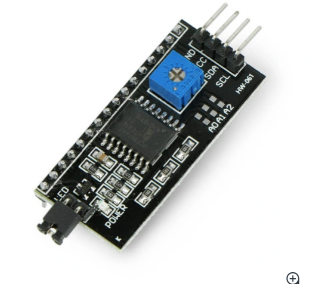
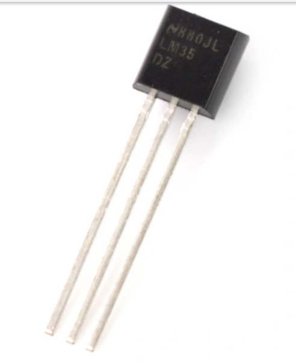
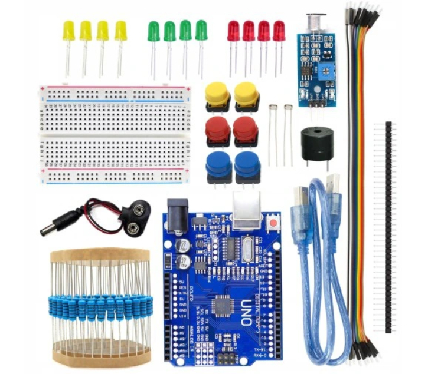
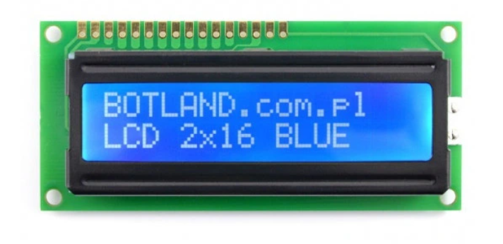
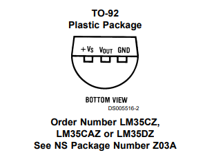
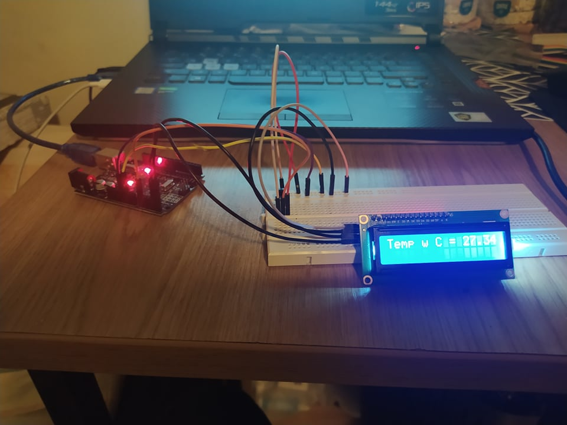
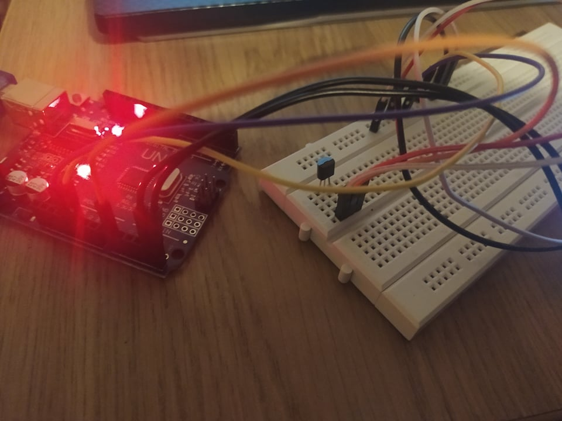
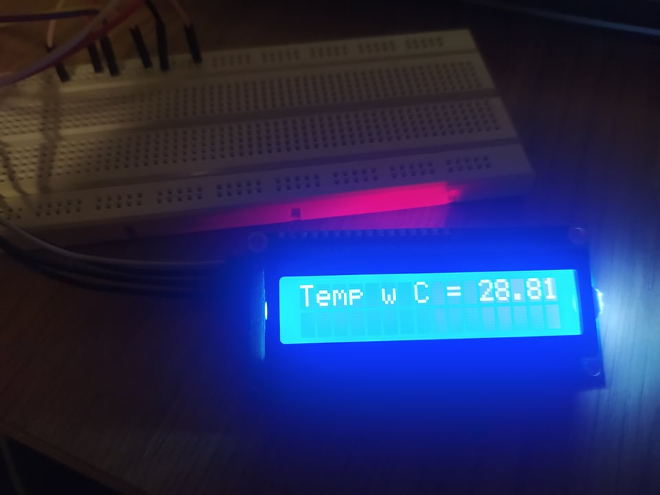
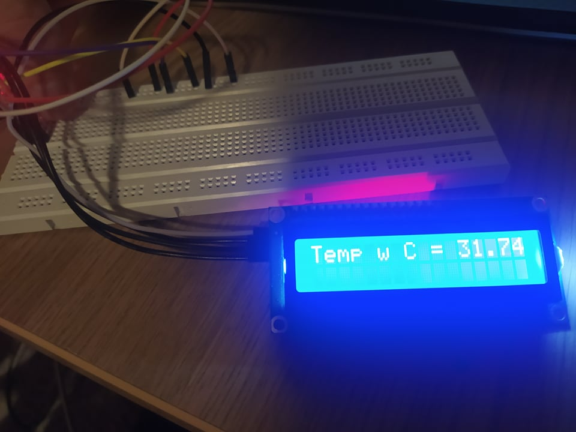
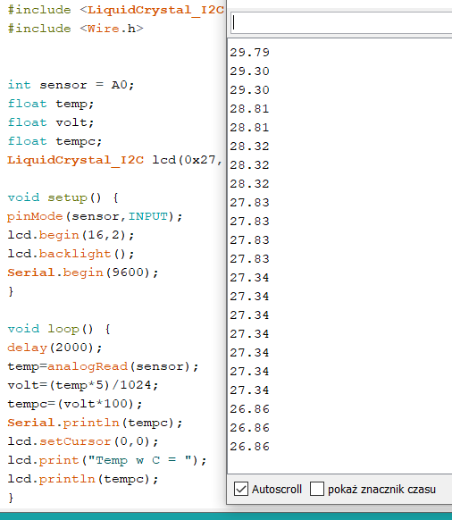

# Projekt

# #Wyświetlanie temperatury otoczenia na wyświetlaczu przy pomocy czujnika temperatury

## Opis

Zamysłem projektu jest pomiar temperatury otoczenia przy pomocy prostego czujnika temperatury (LM35DZ NS) i wyświetlenie aktualnej temperatury na ekranie wyświetlacza(2x16).

## Elementy

* Wyświetlacz LCD 2x16
* Konwerter I2C
* Czujnik temperatury LM35DZ NS
* Arduino UNO
	
## Links

https://botland.com.pl/konwertery-pozostale/2352-konwerter-i2c-dla-wyswietlacza-lcd-hd44780-5903351248693.html

https://botland.com.pl/czujniki-temperatury/376-czujnik-temperatury-lm35dz-ns-analogowy-tht-5904422362508.html 

https://allegro.pl/oferta/zestaw-startowy-do-arduino-uno-r3-atmega328-ch340-10102800766  

https://botland.com.pl/wyswietlacze-alfanumeryczne-i-graficzne/224-wyswietlacz-lcd-2x16-znakow-niebieski-5903351241380.html 

## Budowa

Wyświetlacz LCD lutujemy z konwerterem I2C a następnie konwerter łączymy następująco z wejściami na ARDUINO UNO oraz płytą stykową:

* GND > GND 
* VCC > 5V
* SDA > A4
* SCL > A5

W następnej kolejności łączymy nożki czujnika temperatury (LM35DZ NS) tak jak przedstawiono w dokumentacji (LM35) z płytą stykową a następnie z ARDUINO UNO

Szynę danych łączymy z wejściem A0 na ARDUINO

## KOD

#include <hd44780.h>				//\
#include <LiquidCrystal_I2C.h>		//Wymagane biblioteki\
#include <Wire.h>					//\
\
int sensor = A0;\
float temp;\
float volt;							//Zmienne\
float tempc;\
LiquidCrystal_I2C lcd(0x27, 2, 16);	//Wyświetlacz\
\
void setup() {\
pinMode(sensor,INPUT);\
lcd.begin(16,2);\
lcd.backlight();\
Serial.begin(9600);\
} \
\
void loop() {\
delay(2000);\
temp=analogRead(sensor);				//Odczyt\
volt=(temp*5)/1024;						\
tempc=(volt*100);\
Serial.println(tempc);					//	\
lcd.setCursor(0,0);						//Wyświetlanie\
lcd.print("Temp w C = ");				//\
lcd.println(tempc);\
}\
